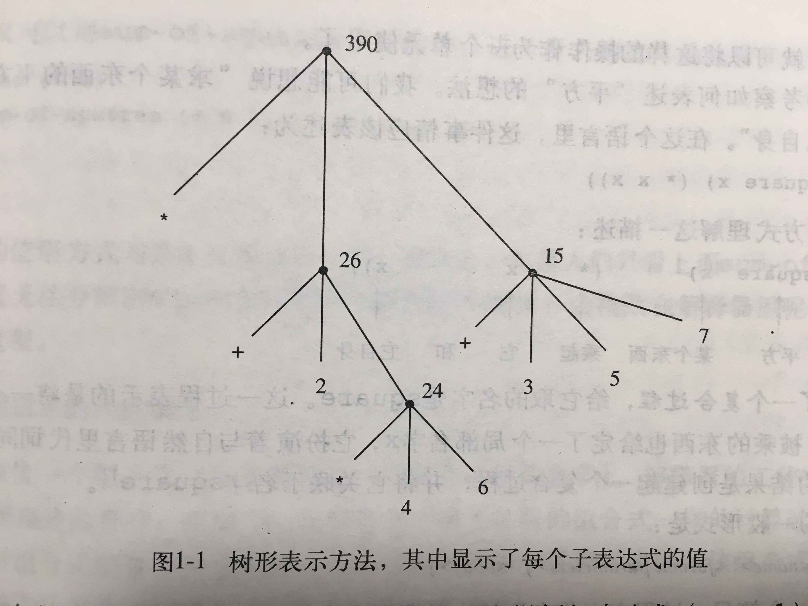

# 1.1程序设计的基本元素
> 每一种强有力的语言都为此提供三种机制：
> * 基本的表达形式，用于表示语言所关心的最简单的个体。
> * 组合的方式，通过它们可以从较简单的东西出发构造出复合的元素。
> * 抽象的方法，通过它们可以为复合对象命名，并将它们当作单元去操作。
> 在程序设计中，我们需要处理两类要素：过程和数据。而这两者并不是严格分离的，数据是一种我们希望去操作的东西，而过程是有关操作这些数据的规则的描述。这样，任何强有力的程序设计语言都必须能表述基本的数据和基本的过程，还需要提供对过程和数据进行组合和抽象的过程。

## 1.1.1 表达式

Scheme中的基本表达式就是数：456、3、8...，解释器则会输出你键入的数的值：456、3、8...。

**组合式：**用表示过程的表达形式，将表示数的表达式组合起来，形成复合表达式。构成方式就是用一对括号括起一些表达式，形成一个表，表里最左边的元素是运算符，其它元素为运算对象。比如：

``` Scheme
(+ 137 349)
(* 3 5 8)
(- 4 9 8 76)
```
这种将运算符放在所有运算对象左边的形式称为**前缀表示**。这种形式的一大好处就是适用于带有任意个实参的过程，表里右边的运算对象可以是任意个。
前缀表示的另一个有点就是可以直接扩充，允许出现组合式嵌套的情况，而且嵌套深度没有限制：

``` Scheme
(/ (* (+ 4 6) (- 97 32)) (+ 98 78))
```

## 1.1.2 命名和环境

**变量：**名字标识符，它的值就是它所对应的那个对象。
Scheme中通过`define`命名变量：

``` Scheme
(define time 30)
age
30
(* age 2)
60
(define distance 100)
distance
100
(define speed (/ distance time))
speed
10/3
```

任何一个复杂的程序都是由一个个简单的过程组成的，通过创建一个程序所需要的名字-对象关联，就可以一步步创建越来越复杂的计算性对象或过程，进而构造一个复杂的程序。

而解释器为了保持名字 -- 对象关联，需要维护某种存储能力，这就被称为**环境**，更准确的说叫做**全局环境**，而在一个计算过程中，完全可能涉及不同的环境。

##1.1.3 组合式的求值

解释器是按照下面的过程求值一个组合式的：
1. 求值该组合式的各个子表达式。
2. 将作为最左子表达式（运算符）的值的那个过程应用于相应的实际参数，也就是其它子表达式（运算对象）的值

而一个深度嵌套的组合式的求值过程，就是在各个子表达式中不断的重复上面的两个过程。这种在自己的计算步骤中，包含了调用这个计算规则本身的需要，这一求值过程就是**递归**。


``` Scheme
(* (+ 2 (* 4 6))
	 (+ 3 5 7))
```
可以用树形来表示上面这一组合式的求值过程，这种“值向上穿行”形式的求值过程被称为**树形积累**。


##1.1.4 复合过程

**过程定义：**可以给某一复合操作过程提供名字，而后可以通过这个名字将这一复合操作作为一个单元使用了。比如定义一个“平方”操作过程：

```Scheme
(define (square x) (* x x))
```
过程定义的一般形式是：

```Scheme
(define (<name> <formal parameters>) <body>)
```
name是关联的过程名字，formal parameters是形式参数，可以有多个，body是具体的操作过程。
也可以将定义好的过程作为基本构件去定义其它过程：

```Scheme
(define (sum-of-square x y) 
	(+ (square x) (square y)))
```
##1.1.5 过程应用的代换模型

> 对于复合过程，过程应用的计算过程是：将复合过程应用于实际参数，就是在将过程体重的每个形参用相应的实参取代之后，对这一过程体求值。

这种计算过程称为过程应用的**代换模型**。

解释器首先对运算符和各个运算对象求值，而后将得到的过程运用于得到的实际参数，这种先求值参数而后应用的方式称为**应用序求值**。

先不求出运算对象的值，而是用运算对象表达式去代换形式参数，直到得到一个只包含基本运算符的表达式，然后再去求值。这种“完全展开而后归约”的求值模型称为**正则序求值**。

Scheme解释器里用的是应用序求值，部分原因在于能避免对于表达式的重复求值，但某些时候，正则序求值也会非常有用，后面的章节会讲到。

##1.1.6 条件表达式和谓词

条件表达式的一般性形式为：

```Scheme
(cond (<p1> <e1>)
		 (<p2> <e2>)
		 (<p3> <e3>)
		 .
		 .
		 (<pn> <en>))		 
```
其中<p>是谓词，是一个表达式，它的值会被解释为真或假（Scheme中#t为真，#f为假）。
上述形式中，会按顺序求值谓词p，直到求出的值为真，然后计算序列表达式e的值，并返回该值。如果没有找到值为真的p，cond的值则没有定义。

另外可以通过else返回一个绝对值：

```Scheme
(cond (<p1> <e1>)
		 (<p2> <e2>)
		 (else x))		

(if <predicate> <consequent> <alternative>)
;if 可以省略else 
```

基本的谓词有`>`、`<`和`=`，逻辑运算符有：
1. 逻辑与：(and <e1>...<en>)
2. 逻辑或：(or <e1>...<en>)
3. 逻辑非：(not <e>)

具体的代码：

```Scheme
(define (abs x)
  (cond ((> x 0) (- x))
        ((= x 0) 0)
        ((< x 0) x)))
        
(define (abs x)
  (cond ((> x 0) (- x))
        (else x))
        
;两个abs等价的

(define (compare x)
  (if (< x 0)
      (- x)
      x))
```


